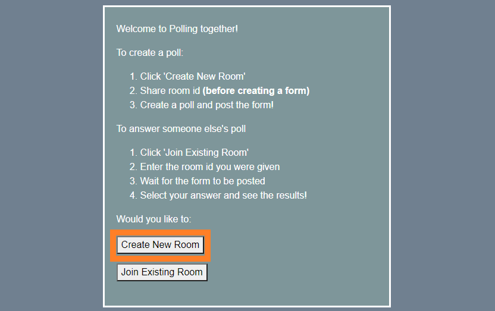
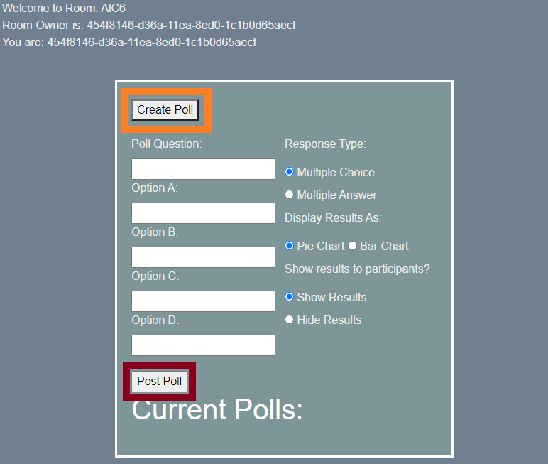

# Welcome to PollTogether

PollTogether is a dynamic poll creation web application with a focus on supporting 'spur of the moment' poll creation. With support for two question types, results formats, and poll creator controls, you can create polls for your friends, students, colleagues, or anyone you choose to invite to your poll.

#  <Creating a Poll

## 1. Create a New Room

## 2. Share the room ID

## 3. Create and Post a Poll
- Response Type: How will the user be able to select answers?
- Risplay Results: How will the results be formatted?
- Show Results: Will the results of the poll be visible to the users?

## 4. Review the Results

# Answering Someone Else's Poll

## 1. Join an Existing Room

## 2. Enter the Room ID

## 3. Answer the Poll

<i>Note: You must be in the room before the poll has been posted</i>
